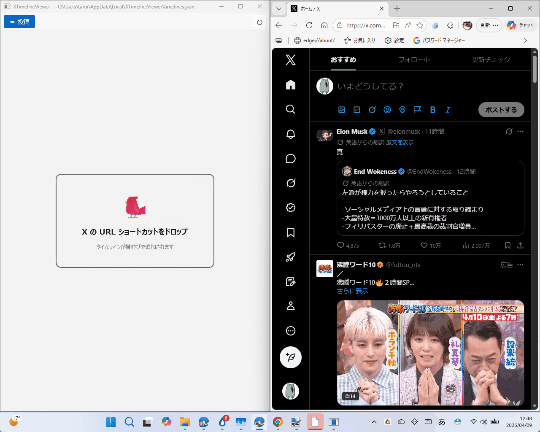

# XTimelineViewer ～ 貧乏人のための「X Pro」（TweetDeck）

[「X Pro」（TweetDeck）が突如「プレミアムプラス」プラン必須に](https://forest.watch.impress.co.jp/docs/news/2096749.html) なって困ったので、Claude の助けを借りて開発しました。


複数の X（旧 Twitter）タイムラインを横並びで表示する Windows デスクトップ アプリです。構造としては ** 「細長い Edge を横に並べているだけ」 ** なので、アカウント停止になることは考えづらいと思います（API は利用していません）。

## 特徴

- X のタイムラインを複数、横並びで同時表示
- URL ショートカット（`.url` ファイル）をウィンドウにドロップして簡単追加
- ヘッダーのドラッグ＆ドロップでタイムラインを並び替え
- ライト / ダーク / システム連動のテーマ切り替え
- ヘッダーや投稿ボックスの非表示など、タイムラインごとの表示設定
- ホームタイムラインの新着ポストを自動表示
- Chromium 拡張機能のサポート（**TwitterTimelineLoader** を同梱）
- キーボードショートカット対応

## 動作要件

- Windows 10 バージョン 19041 以降（Windows 11 推奨）
- [Microsoft Edge Dev](https://www.microsoft.com/ja-jp/edge/download/insider) チャンネル（`C:\Program Files (x86)\Microsoft\Edge Dev\Application` にインストール済みであること）

## 使い方

### タイムラインの追加

エクスプローラーで X の URL ショートカット（`.url` ファイル）を作成し、アプリウィンドウにドラッグ＆ドロップします。`x.com` または `twitter.com` の URL が自動的に認識されます。

Edge で追加したい `x.com` ページを開き、アドレスバーのアイコンをドラッグ＆ドロップしてもかまいません。



### タイムラインの操作

| 操作 | 動作 |
|---|---|
| ヘッダーをクリック | タイムラインをフォーカス |
| ヘッダーをダブルクリック | ハードリロード（再読み込み） |
| ヘッダーをドラッグ | タイムラインを並び替え |
| ⚙ ボタン | 幅・ヘッダー表示・投稿ボックス表示を設定 |
| ✕ ボタン | タイムラインを削除 |

### キーボードショートカット

| ショートカット | 動作 |
|---|---|
| `Ctrl+→` | 右のタイムラインへフォーカス移動 |
| `Ctrl+←` | 左のタイムラインへフォーカス移動 |
| `Home` | タイムラインを先頭へスクロール |
| `End` | タイムラインを末尾へスクロール |
| `F5` | タイムラインをリロード |
| `Ctrl+N` | 新規投稿ダイアログを開く |
| `Ctrl+↑` | 前のポストへフォーカス |
| `Ctrl+↓` | 次のポストへフォーカス |
| `Ctrl+R` | フォーカス中ポストをリツイート（リポスト） |
| `Ctrl+B` | フォーカス中ポストをブックマーク |
| `Ctrl+F` | フォーカス中ポストをお気に入り（いいね） |
| `Backspace` | ナビゲーションの「戻る」 |

> テキスト入力中は `Ctrl+R`・`Ctrl+B`・`Ctrl+F`・`Backspace` は無効になります。

### 投稿

ツールバー左の **✏ 投稿** ボタン（または `Ctrl+N`）をクリックすると、投稿ダイアログが開きます。投稿後、または投稿画面から離れると自動的に閉じます。

## 拡張機能

このアプリは拡張機能に対応しており、extensions フォルダーに展開済みの拡張機能を配置すると、起動時に自動で読み込みます。

初期状態で、以下の拡張機能を同梱させていただいています。

### TwitterTimelineLoader

ホームタイムライン（`x.com/home`）を一定間隔で自動更新する Chromium 拡張機能です。

- スクロールが先頭付近のときだけ自動更新（読んでいる途中は更新しない）
- テキスト入力中は更新しない
- ツールバーの 🧩 ボタンから更新間隔を設定可能（デフォルト 7.5 秒、最短 5 秒）

## 設定の保存先

タイムライン設定は以下のファイルに JSON 形式で自動保存されます。

```
%LOCALAPPDATA%\XTimelineViewer\timelines.json
```

## ダウンロード

[Releases · daruyanagi/XTimelineViewer](https://github.com/daruyanagi/XTimelineViewer/releases)

<a href="https://get.microsoft.com/installer/download/9P308HB5BLJ1?referrer=appbadge" target="_self" >
	
</a>

手元では Windows 11 Pro （Retail）で動作を確認しています。

## ライセンス

MIT

（同梱されている拡張機能などには適用されません）
