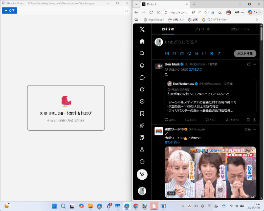

# XTimelineViewer ～ 貧乏人のための「X Pro」（TweetDeck）

[「X Pro」（TweetDeck）が突如「プレミアムプラス」プラン必須に](https://forest.watch.impress.co.jp/docs/news/2096749.html) なって困ったので、Claude の助けを借りて開発しました。


複数の X（旧 Twitter）タイムラインを横並びで表示する Windows デスクトップ アプリです。構造としては ** 「細長い Edge を横に並べているだけ」 ** なので、アカウント停止になることは考えづらいと思います（API は利用していません）。

## 特徴

- X のタイムラインを複数、横並びで同時表示
- URL ショートカット（`.url` ファイル）をウィンドウにドロップして簡単追加
- ヘッダーのドラッグ＆ドロップでタイムラインを並び替え
- ライト / ダーク / システム連動のテーマ切り替え
- ヘッダーや投稿ボックスの非表示など、タイムラインごとの表示設定
- ホームタイムラインの新着を自動更新（ON/OFF・更新間隔を設定可能）
- Chromium 拡張機能のサポート
- キーボードショートカット対応

## 動作要件

- Windows 10 バージョン 19041 以降（Windows 11 推奨）
- [Microsoft Edge Dev](https://www.microsoft.com/ja-jp/edge/download/insider) チャンネル（`C:\Program Files (x86)\Microsoft\Edge Dev\Application` にインストール済みであること）

## 使い方

### タイムラインの追加

エクスプローラーで X の URL ショートカット（`.url` ファイル）を作成し、アプリウィンドウにドラッグ＆ドロップします。`x.com` または `twitter.com` の URL が自動的に認識されます。

Edge で追加したい `x.com` ページを開き、アドレスバーのアイコンをドラッグ＆ドロップしてもかまいません。



### タイムラインの操作

| 操作 | 動作 |
|---|---|
| ヘッダーをクリック | タイムラインをフォーカス |
| ヘッダーをダブルクリック | ハードリロード（再読み込み） |
| ヘッダーをドラッグ | タイムラインを並び替え |
| ⚙ ボタン | 幅・ヘッダー表示・投稿ボックス表示を設定 |
| ✕ ボタン | タイムラインを削除 |

### キーボードショートカット

| ショートカット | 動作 |
|---|---|
| `Ctrl+→` | 右のタイムラインへフォーカス移動 |
| `Ctrl+←` | 左のタイムラインへフォーカス移動 |
| `Ctrl+1`〜`9` | 左から N 番目のタイムラインへフォーカス移動 |
| `Home` | タイムラインを先頭へスクロール |
| `End` | タイムラインを末尾へスクロール |
| `F5` | タイムラインをリロード |
| `Ctrl+N` | 新規投稿ダイアログを開く |
| `Ctrl+↑` | 前のポストへフォーカス |
| `Ctrl+↓` | 次のポストへフォーカス |
| `Ctrl+R` | フォーカス中ポストをリツイート（リポスト） |
| `Ctrl+B` | フォーカス中ポストをブックマーク |
| `Ctrl+F` | フォーカス中ポストをお気に入り（いいね） |
| `Backspace` | ナビゲーションの「戻る」 |

> テキスト入力中は `Ctrl+R`・`Ctrl+B`・`Ctrl+F`・`Backspace` は無効になります。

### 投稿

ツールバー左の **✏ 投稿** ボタン（または `Ctrl+N`）をクリックすると、投稿ダイアログが開きます。投稿後、または投稿画面から離れると自動的に閉じます。

## ホームタイムラインの自動更新

ホームタイムライン（`x.com/home`）の新着ポストを、アプリが一定間隔で自動的に取り込みます。設定の **［全般］→「ホームタイムラインの自動更新」** から ON/OFF と更新間隔（デフォルト 8 秒、最短 5 秒）を変更できます。

- スクロールが先頭付近のときだけ自動更新（読んでいる途中は更新しない）
- リプライ・引用の入力中や検索中は更新しない（下書き消失・誤操作を防止）
- ヘッダーの設定ボタン左に状態インジケーター（稼働中／一時停止中／オフ）を表示

> この機能は、Chromium 拡張機能 **TwitterTimelineLoader** のアイデアと実装を参考に内製化したものです（謝辞はアプリの「バージョン情報」を参照）。ページ全体を再読み込みする「定期ハードリロード」（ヘッダーのダブルクリック）とは別の機能です。

## 拡張機能

このアプリは Chromium 拡張機能に対応しており、`extensions` フォルダーに展開済みの拡張機能を配置すると、起動時に自動で読み込みます。

## 設定の保存先

設定の保存先は、アプリの形式（ZIP/MSIX）によって異なります。

タイトルバーで確認するか、設定のエクスポートメニューからエクスプローラーを開いてアクセスしてください。

## ダウンロード

[Releases · daruyanagi/XTimelineViewer](https://github.com/daruyanagi/XTimelineViewer/releases) から ZIP を入手できます。

winget でもインストールできます:

```
winget install daruyanagi.XTimelineViewer
```

手元では Windows 11 Pro （Retail）で動作を確認しています。

## コマンドラインから起動

winget でインストールするか、ZIP に同梱の `xtv.exe` を使うと、ターミナルや「ファイル名を指定して実行（Win+R）」から起動できます。

```
xtv
```

- `xtv` … 短縮コマンド（推奨）
- `xtimelineviewer` … 従来の別名（後方互換のため残しています）

ZIP を手動展開した場合は、フォルダ内の `xtv.exe` を直接ダブルクリック・検索・スタートにピン留めしても起動できます。`xtv.exe` は本体 `XTimelineViewer.exe` を正しい作業ディレクトリで起動する小さなランチャーで、winget の symlink 経由でも DLL 解決に失敗しません（詳細は `tools/launcher/README.md`）。

## リリース手順

**GitHub リリース（ZIP）と winget 公開**は CI（`.github/workflows/release.yml`）が `v*` タグの push をトリガーに自動で行う。

```powershell
# バージョンを上げる（csproj と Package.appxmanifest を一括更新）
.\Release.ps1 -Version 1.9.0

# ローカル検証用に ZIP を生成したいとき（本番 ZIP は CI が作る）
.\Release.ps1 -WithZip
```

生成後の流れ:

1. バージョン更新分をコミット & PR → main にマージ
2. `v<バージョン>` タグを push（または `gh release create v<バージョン>`）→ CI が GitHub リリースの ZIP と winget 公開を自動実行

> Microsoft Store での配布は行っていません（[#272](https://github.com/daruyanagi/XTimelineViewer/issues/272)）。

## ライセンス

MIT

（同梱されている拡張機能などには適用されません）
